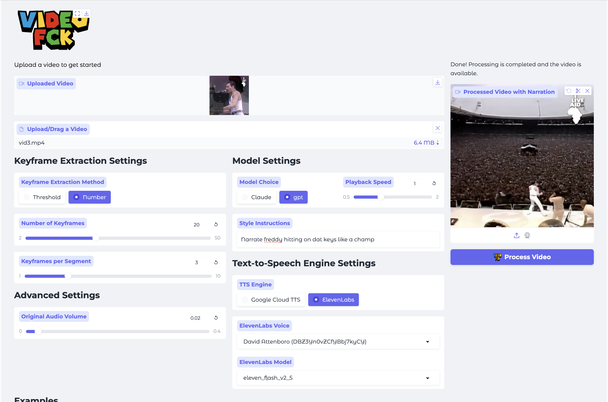

<h1 align="center">
  <br>
  VideoFck (by LordHaziza): AI-Powered Video Narration App </h1>
<h1 align="left">



###
https://github.com/user-attachments/assets/577a2039-8bd5-4e6c-b461-f3f3538a2810

### **VIDEOFCK** is an open-source tool that automatically generates voiceovers and narrations for videos. It understands video content by analyzing keyframes, splits the video into segments, and produces high-quality output video with AI-generated narration or voiceovers.

---


## Setup Instructions

Follow these steps to set up VideoFck (by LordHaziza) on your local machine:

1.  **Clone the Repository:**
    ```bash
    git clone https://github.com/Ido108/VIDEOFCK.git
    ```
2.  **Run the Setup Script:**

    *   **Windows:** Double-click the `setup.bat` file.
    *   **macOS/Linux:** Run `./setup.sh` in your terminal.

    Follow the installation steps and add your api keys during the setup. (links to API keys for each platform provided during setup)

3.  **Run the application:**
    *   **Windows:** Double-click `start.bat`
    *   **macOS/Linux:** Run `./start.sh`

## ✨ Features

📹 **Keyframe Analysis:** Detects important scenes in the video.  
📝 **Segmented Processing:** Splits videos into logical segments for accurate narration.  
🎤 **AI-Powered Narration:** Generates captions and converts them to speech using **ElevenLabs** and **Google TTS**.  
🎨 **Custom Narration Styles:** Customize narration tone, speed, and style.  
🎞 **Subtitles (Optional):** Burn subtitles directly into the video.  

## Prerequisites

Before using VideoFck (by LordHaziza), ensure you have the following:

*   **Python 3.6+** installed on your system.
*   **`pip`** (Python's package installer).
*   **API Keys:**
    *   ElevenLabs API Key (if using ElevenLabs TTS).
    *   OpenAI API Key (if using GPT model).
    *   Claude API Key (if using Claude model).
    *   Gemini API Key.
## Note: For using Google TTS You need to set your service account details and google api in the env file. More details here: https://cloud.google.com/text-to-speech/docs/authentication
*   **Google Cloud SDK:** For Google Cloud TTS and you must install the Google Cloud SDK: [https://cloud.google.com/sdk/docs/install](https://cloud.google.com/sdk/docs/install), and have a [Google Service Account Key](https://cloud.google.com/iam/docs/keys-create-delete) which its path must be inserted when prompted (Optional). You can Always add it in ".env" file.


## Using the Application

1.  **Upload Video:** Upload a video file using the file input component.
2.  **Keyframe Settings:** Choose your keyframe extraction method and settings.
    *  **Threshold**: extract keyframes based on the threshold parameter
    *  **Number (recommended)**: extract a specific number of keyframes, evenly spaced in the video.
    *   Adjust `keyframes per segment` to control the number of keyframes that are given to the LLM for caption and narration generation.
3.  **Model Settings:**
    *   Choose between the **Claude** or **GPT** model for captions and narrations.
    *   Adjust playback speed and add style instructions.
4.  **Text-to-Speech (TTS):** Select a TTS Engine (Google Cloud TTS or ElevenLabs), a voice, and model if using ElevenLabs.
6.  **Original Audio Volume**: Change the original audio volume if needed, this is useful if you wish to keep the original audio with a low volume along with the generated narrations.
7.  **Process Video:** Click the "Process Video" button to begin generating the output video.
8.  **View the results:** When the app finishes, it will present you the processed video in the player, and it will show the path for where the json files and the video where saved, for your convenience.


## 💪 Use Cases

- **Content Creators:** Automate voiceovers for YouTube, TikTok, or other platforms.  
- **Educators:** Easily create narrated educational videos.  
- **Marketers:** Generate quick, professional promotional content.  
- **Accessibility:** Add voice narration to improve content accessibility.  

## Enjoy mf
</h1>
